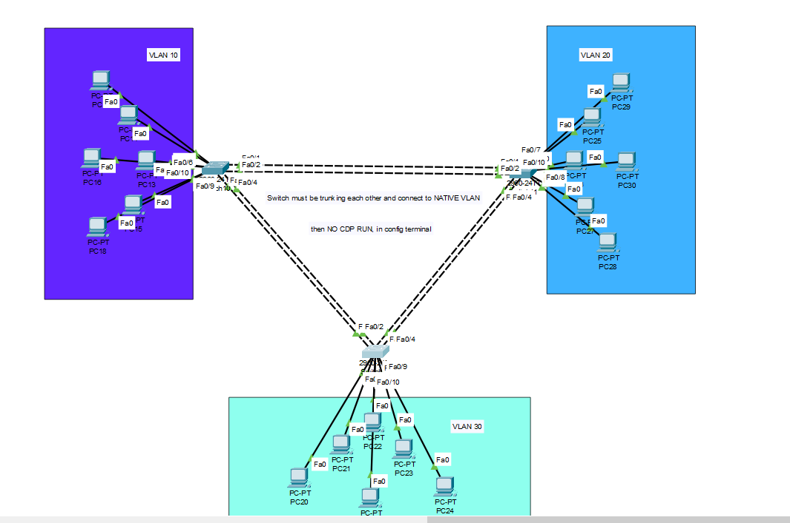
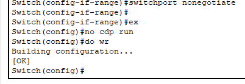
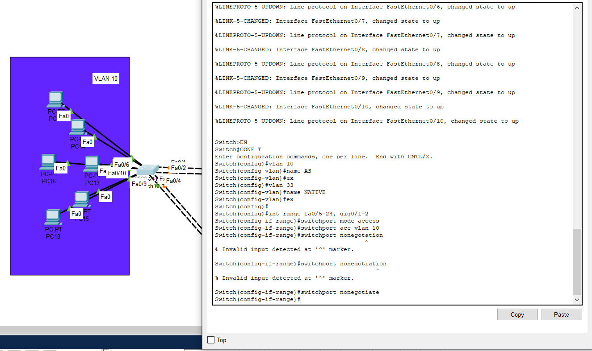
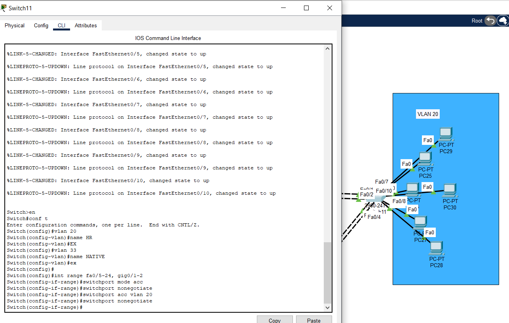
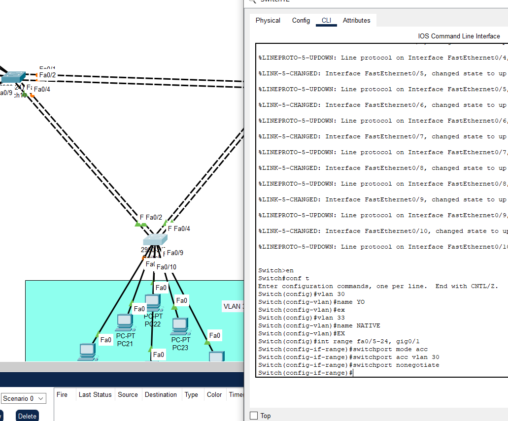

# VLAN Hopping Attack Prevention Lab

## Overview
This repository demonstrates security best practices for preventing VLAN hopping attacks in Cisco switched networks. The lab showcases proper VLAN configuration, trunk hardening, and access port security to mitigate double-tagging and switch spoofing attacks.

## Network Topology
The network consists of three interconnected switches with multiple VLANs:
- **VLAN 10** (Purple zone) - User network segment
- **VLAN 20** (Blue zone) - User network segment  
- **VLAN 30** (Cyan zone) - User network segment
- **NATIVE VLAN 33** - Secured trunk native VLAN



## What is VLAN Hopping?
VLAN hopping is a network attack where an attacker gains unauthorized access to traffic on other VLANs by exploiting:
1. **Double Tagging Attack**: Exploiting native VLAN configuration
2. **Switch Spoofing**: Impersonating a switch via DTP (Dynamic Trunking Protocol)

## Security Measures Implemented

### 1. Native VLAN Configuration
```cisco
spanning-tree mode pvst
spanning-tree extend system-id

interface FastEthernet0/1
 switchport trunk native vlan 33
 switchport mode trunk
 switchport nonegotiate
```
### 2. Disable DTP on Trunk Ports
```cisco
interface range fa0/1-4, gi0/1-2
 switchport mode trunk
 switchport nonegotiate
```

The `switchport nonegotiate` command disables Dynamic Trunking Protocol (DTP), preventing switch spoofing attacks.



### 3. Access Port Hardening
```cisco
interface range fa0/5-24
 switchport mode access
 switchport access vlan 10
 switchport nonegotiate
```

**Security Benefits**:
- Explicitly set ports to access mode
- Assign to specific VLANs
- Disable DTP negotiation on access ports


## Configuration Highlights

### VLAN 10 Configuration


### VLAN 20 Configuration  


### VLAN 30 Configuration


## Attack Scenarios Prevented

### 1. Double-Tagging Attack
**Without Protection**: Attacker on VLAN 1 (native) sends double-tagged frames to access VLAN 10
**With Protection**: Native VLAN changed to unused VLAN 33, attack fails

### 2. Switch Spoofing Attack
**Without Protection**: Attacker negotiates trunk via DTP and gains access to all VLANs
**With Protection**: `switchport nonegotiate` prevents DTP, attack fails

## Best Practices Implemented

✅ **Native VLAN Security**
- Changed native VLAN from default VLAN 1 to VLAN 33
- Ensured native VLAN is not used for user traffic
- Configured same native VLAN on both ends of trunk

✅ **DTP Hardening**
- Disabled DTP on all trunk ports with `switchport nonegotiate`
- Explicitly configured trunk mode (not auto or desirable)
- Disabled DTP on access ports

✅ **Access Port Security**
- Explicitly configured ports as access ports
- Assigned specific VLANs to access ports
- Disabled negotiation on access ports

✅ **Trunk Port Security**
- Used `switchport mode trunk` instead of dynamic modes
- Configured allowed VLANs on trunk links
- Disabled unused ports

## Network Segmentation
The topology demonstrates proper network segmentation:
- **VLAN 10**: Department A users (Purple zone)
- **VLAN 20**: Department B users (Blue zone)
- **VLAN 30**: Department C users (Cyan zone)
- **Trunks**: Properly configured with native VLAN 33

## Lab Commands Used

### VLAN Configuration
```cisco
vlan 10
 name AS
vlan 20
 name HR
vlan 30
 name YO
vlan 33
 name NATIVE
```

### Interface Configuration
```cisco
interface range fa0/5-24, gi0/1-2
 switchport mode access
 switchport access vlan 10
 switchport nonegotiate

interface range fa0/1-4
 switchport trunk native vlan 33
 switchport mode trunk
 switchport nonegotiate
```

### Verification Commands
```cisco
show vlan brief
show interfaces trunk
show interfaces switchport
show spanning-tree summary
```

## Repository Structure
```
.
├── assets/
│   ├── full-topology.png
│   ├── vlan10-config.png
│   ├── vlan20-config.png
│   ├── vlan30-config.png
│   ├── native-vlan-config.png
│   ├── trunk-config.png
│   ├── access-port-config.png
│   └── switchport-nonegotiate.png
├── configs/
│   ├── switch1-config.txt
│   ├── switch2-config.txt
│   └── switch3-config.txt
└── README.md
```

## Critical Security Notes

⚠️ **Important Security Warnings**:

1. **Never use VLAN 1 as native VLAN** - It's the default and commonly targeted
2. **Always disable DTP** - Use `switchport nonegotiate` on all ports
3. **Don't use unused native VLANs for user traffic** - Keep them empty
4. **Explicitly configure port modes** - Never rely on auto/desirable
5. **Match native VLANs on both ends** - Mismatches create security risks

## Testing the Configuration

### Verify Trunk Configuration
```cisco
Switch>show interfaces trunk

Port        Mode         Encapsulation  Status        Native vlan
Fa0/1       on           802.1q         trunking      33
Fa0/2       on           802.1q         trunking      33
```

### Verify Native VLAN
```cisco
Switch>show interfaces fa0/1 switchport
Name: Fa0/1
Switchport: Enabled
Administrative Mode: trunk
Trunking Native Mode VLAN: 33
Administrative Native VLAN tagging: enabled
```

### Verify DTP is Disabled
```cisco
Switch>show interfaces fa0/1 switchport
Administrative Mode: trunk
Negotiation of Trunking: Off
```

## Learning Outcomes

This lab demonstrates:
1. Understanding of VLAN hopping attack vectors
2. Implementation of trunk security best practices
3. Native VLAN security configuration
4. DTP hardening techniques
5. Access port security measures
6. Network segmentation principles
7. Defense-in-depth approach to VLAN security

## Common Misconfigurations to Avoid

❌ **Dangerous Configurations**:
- Using VLAN 1 as native VLAN
- Leaving DTP enabled (dynamic auto/desirable)
- Mismatched native VLANs on trunk links
- Not explicitly setting port modes
- Using native VLAN for user traffic

✅ **Secure Configurations**:
- Native VLAN 33 (unused VLAN)
- `switchport nonegotiate` on all ports
- Explicit `switchport mode trunk` or `access`
- Same native VLAN on both trunk ends
- Native VLAN reserved for management only

## Additional Security Layers

Consider implementing these additional security measures:
- Port security (MAC address limiting)
- DHCP snooping
- Dynamic ARP Inspection (DAI)
- IP Source Guard
- Private VLANs
- 802.1X authentication

## References

- Cisco VLAN Security Best Practices
- VLAN Hopping Attack Documentation
- Cisco Switch Security Configuration Guide
- Network Security Best Practices

## Lab Environment
- Cisco Packet Tracer / GNS3
- Cisco IOS switches (2960/2970 series)
- Multiple VLANs (10, 20, 30, 33)
- Trunk and access port configurations

## Getting Started

1. Review the network topology
2. Examine the security configurations
3. Understand the attack vectors being prevented
4. Test the configuration using verification commands
5. Try to perform VLAN hopping attacks to verify protection

## License
Educational/Lab purposes

---
*This lab demonstrates enterprise-grade VLAN security practices to prevent VLAN hopping attacks.*
